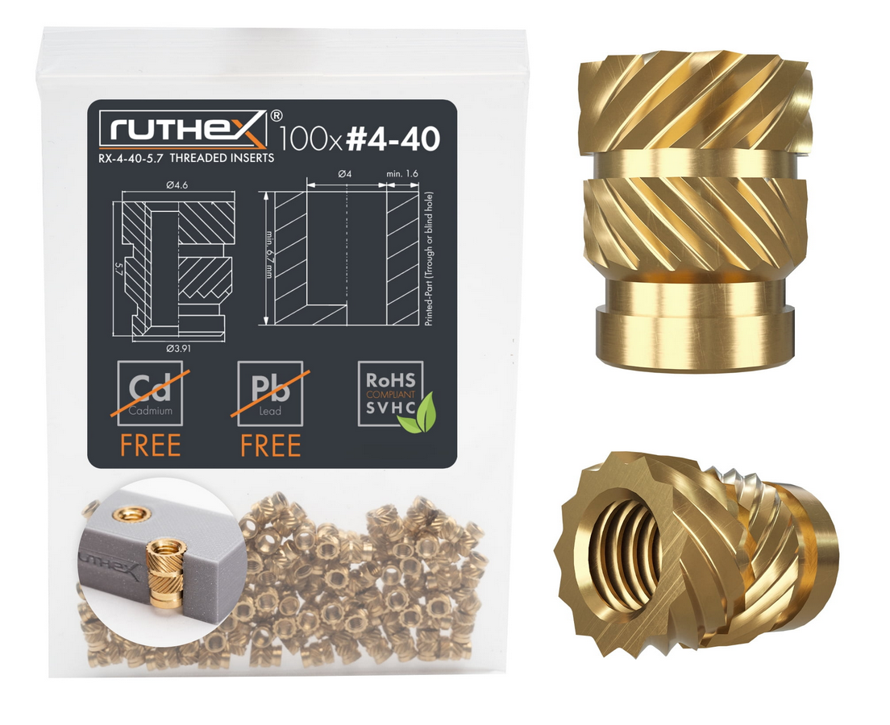
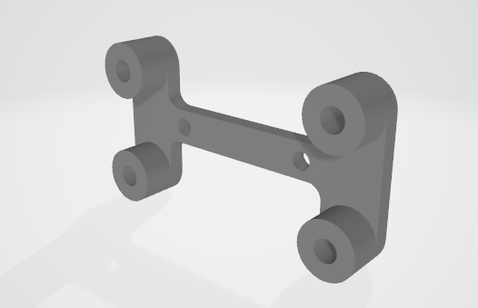
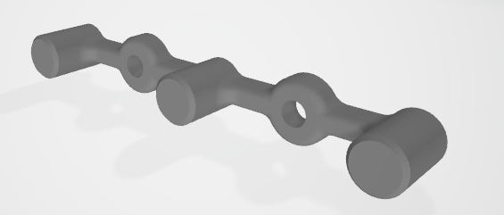

# 3d Printed Parts

## Thread Inserts

## 4-40 Quarter Inch Screws

## #4 Wood Screws

[Mcmaster-Carr Part number 98685A540](https://www.mcmaster.com/98685A540/)

## Arduino Bracket

Print one of these per controller.  This works for both Arduino UNO and Arduino Mega. Screw into wood using #4 wood screws.  

Use 4-40 brass thread inserts, press them in with a soldering iron. 

 

 

## DC DC converter Bracket

Use 4-40 brass thread inserts, press them in with a soldering iron

 

## Front Panel Edge Bracket

Use 4-40 brass thread inserts, press them in with a soldering iron. Attach to wood with #4 wood screws. 

 

 

## Front Panel Center Bracket

place in center area of circuit board to prevent bowing, use #4 wood screws to mount.

 

 

## Arduino UNO Hole Pattern

