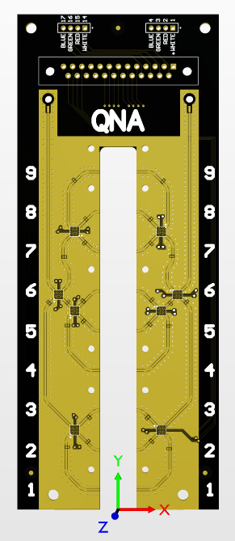
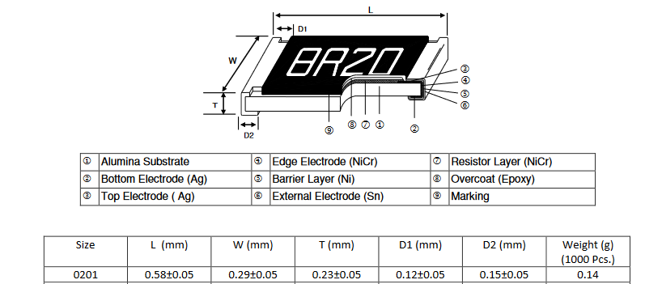

# [Quantum Network Analyzer](https://github.com/lafefspietz/QNA/)

System for calibrated high throughput microwave scattering parameter measurement using quantum standards.

Microwave lines are expensive.  Dil fridges are expensive.  Adding cryogenic RF switches to a system can be a force multiplier for both microwave measurement infrastructure and cryogenic infrastructure, multiplying up the number of chips which can be measured per cool down by however many RF lines the switch network adds. 

The system documented here turns one RF line into 9 by taking a single RF input, using switches to split between 9 quantum samples, and then a second switch network which feeds a single RF output. A mechanical assembly with COTS cryogenic RF devices will allow for measuring all 4 scattering parameters with a single RF in and RF output.  

Calibration software which can use a standard qubit chip to measure test chips will be part of the system.  An Arduino-based rack mount controller is part of the system as well.





## System Elements

 - Wood board to fit in 19 inch rack
 - Control panel circuit board
 - 3d printed parts to connect circuit boards to wood board
 - Custom machined aluminum box to contain 90 volt electronics
 - DSUB to Fischer cable to connect to dil fridge
 - Arduino Mega 
 - Arduino Mega shield circuit board and components
 - DC DC converter built from COTS circuits
 - Relay control board with pull down resistors which selects which DC lines are energized with 90 volts
 - 1x9x1 switch board which puts 9 quantum devices in a single cryogenic RF line
 - Mounting bracket for COTS cryogenic RF components
 - Collection of COTS cryogenic RF components which bold to the above bracket
 - Sample enclosure
 - Outer sample box lid with small opening for changing samples and wire bonding
 - Inner sample box lid over sample opening
 - Standard qubit chips of different sizes
 - Arduino control code
 - Python control code
 - Calibration method based on tunable qubit chips to determine both scattering parameter calibration and noise calibration


 - [14X pixels Flora RGB Smart NeoPixel version 3 - Sheet of 20](https://www.adafruit.com/product/1559)
 - [14X SPST tactile switch, E-Switch part number TL59NF160Q](https://www.digikey.com/en/products/detail/e-switch/TL59NF160Q/390533)
 - [1X 5 wire cables](https://www.amazon.com/StarTech-USBINT5PIN-Internal-Motherboard-Header/dp/B003HHROBG/)
 - [14X 10 k 0.1% axial reistors, Yageo part number MFP-25BRD52-10K](https://www.digikey.com/en/products/detail/yageo/MFP-25BRD52-10K/2058797)

[](https://www.adafruit.com/product/1559)

[](https://www.digikey.com/en/products/detail/e-switch/TL59NF160Q/390533)

[](https://www.amazon.com/StarTech-USBINT5PIN-Internal-Motherboard-Header/dp/B003HHROBG/)

[](https://www.digikey.com/en/products/detail/yageo/MFP-25BRD52-10K/2058797)


 - [arduino-to-headers-shield-gerberes.zip](arduino-to-headers-shield-gerberes.zip)
 - [1000 uF 16 V electrolytic capacitor, Rubycon part number 16PK1000MEFC10X12.5](https://www.digikey.com/en/products/detail/rubycon/16PK1000MEFC10X12-5/3563556)
 - [100 kOhm Stackpole Electronics part number RNF14FTD100K](https://www.digikey.com/en/products/detail/stackpole-electronics-inc/RNF14FTD100K/1706591)
 - [330 Ohm Stackpole Electronics part number CF18JT330R](https://www.digikey.com/en/products/detail/stackpole-electronics-inc/CF18JT330R/1741683)
 - [0.1 inch header strips](https://www.amazon.com/Header-Lystaii-Pin-Connector-Electronic/dp/B06ZZN8L9S/)

[](https://www.digikey.com/en/products/detail/rubycon/16PK1000MEFC10X12-5/3563556)


Add link here to the 4 and 8 pin cables which connect these boards


 - [DB25-relay-HV-control-gerbers.zip](DB25-relay-HV-control-gerbers.zip)
 - [DB25-relay-HV-control-gerbers.PcbDoc](DB25-relay-HV-control-gerbers.PcbDoc)
 - [DB25-relay-HV-control-gerbers.PrjPcb](DB25-relay-HV-control-gerbers.PrjPcb)
 - [DB25-relay-HV-control-gerbers.](DB25-relay-HV-control-gerbers.PrjPcbStructure)
 - [DB25-relay-HV-control-gerbers.](DB25-relay-HV-control-gerbers.SchDoc)
 - [24 x 5 volt relay, Comus International part number 3570-1331-053](https://www.digikey.com/en/products/detail/comus-international/3570-1331-053/7497099)
 - [24x 1 MOhm resistor in SMT 1206 package, Yageo part number RC1206FR-071ML](https://www.digikey.com/en/products/detail/yageo/RC1206FR-071ML/728388)
 - [1x Board mount female DB-25 connector, Assmann part number A-DF 25 PP/Z](https://www.digikey.com/en/products/detail/assmann-wsw-components/A-DF-25-PP-Z/1241794)
 - [0.1 inch header strips](https://www.amazon.com/Header-Lystaii-Pin-Connector-Electronic/dp/B06ZZN8L9S/)

# 1x9x1


### [Marki Microwave C20-0240 Directional Coupler](https://markimicrowave.com/products/connectorized/directional-couplers/c20-0240/)


### [CryoElec SP3T coaxial switch](https://www.cryoelec.com/products/cryoswitchsp3t)

Versions can be constructed for 5 mm chips, 5.06 mm chips, 7.5 mm chips, 10 mm chips, and SMP connectors to break out to external devices.

Install [xampp](https://www.apachefriends.org/).

Install [Anaconda](https://docs.anaconda.com/anaconda/install/)

Open an anaconda prompt and type the following 

```
jupyter notebook --notebook-dir=c:\xampp\htdocs\quantumswitch
```

## 1x9x1 System Elements


### 1x9x1 PCB, RF Pool with RO4350

### [Eurocircuits RF Pool link](https://www.eurocircuits.com/pcb-assembly-rf-pool/)


## 2X

### [TE Connectivity 2-292161-4 CONN HEADER VERT 4POS 2MM](https://www.digikey.com/en/products/detail/te-connectivity-amp-connectors/2-292161-4/5124519)


## 2X

### [Molex 085305-0232 SMT SMP connector](https://www.digikey.com/en/products/detail/molex/0853050232/2421464)


## 1X

### [Cinch Connectivity Solutions M83513/25-D01CP 25 pin microD board mount connector](https://www.digikey.com/en/products/detail/cinch-connectivity-solutions/M83513-25-D01CP/12471446)


## 8X

### [Menlo Micro MM5130-03NDB-TR RF Switch ICs DC-26GHz - SP4T - 2.5 mm x 2.5 mm 29 pin](https://mou.sr/4fuziKD)



### 24X

### [TE Connectivity CPF0201B56K2E1  56 k Ohm 0201 surface mount resistor](https://www.digikey.com/en/products/detail/te-connectivity-passive-product/CPF0201B56K2E1/14007085)


