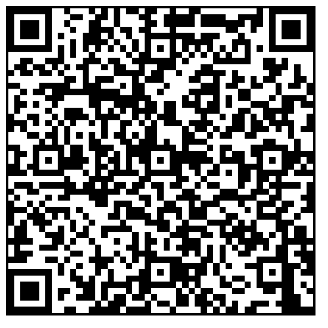
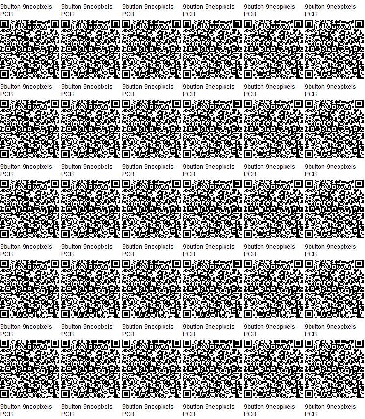

## [Up to PCB/](../)

# 9button-9neopixel Printed Circuit Board(PCB)

## Files

 - [Altium Schematic .SchDoc](9button-9neopixel.schDoc)
 - [Altium project file .PrjPcb](9button-9neopixel.PrjPcb)
 - [Altium Pcb File .PcbDoc](9button-9neopixel.PrjPcb)
 - [.zip of Gerber files](9button-9neopixel-gerbers.zip)