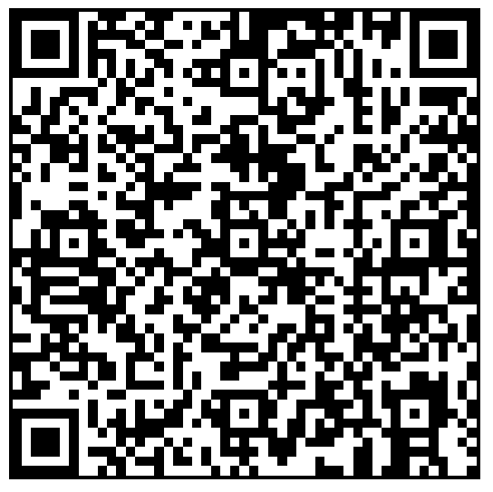
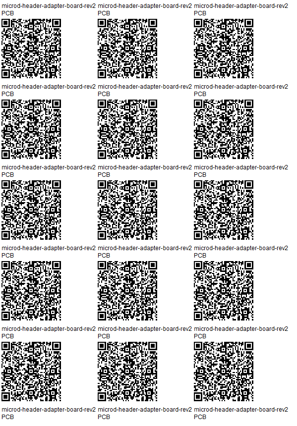
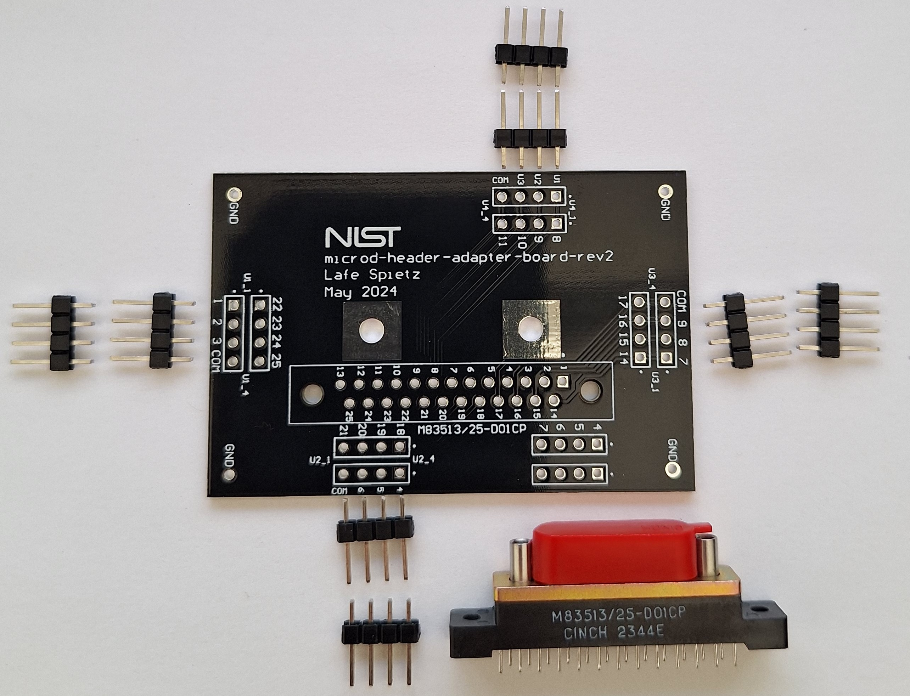

## [Up to PCB/](../)

 
 
# microd-header-adapter-board-rev2 Printed Circuit Board(PCB)

## Bill of Materials

 - [PCB's](https://www.pcbway.com)
 - [1 MOhm 1206 SMT resistors]()
 - [DB25 board mount connector]()
 - [relays]()
 - [header strips (40 pins)](https://www.digikey.com/en/products/detail/amphenol-cs-commercial-products/G800W268018EU/17083164)

## Files

 - [Altium Schematic .SchDoc](microd-header-adapter-board-rev2.schDoc)
 - [Altium project file .PrjPcb](microd-header-adapter-board-rev2.PrjPcb)
 - [Altium Pcb File .PcbDoc](microd-header-adapter-board-rev2.PrjPcb)
 - [.zip of Gerber files](microd-header-adapter-board-rev2-gerbers.zip)